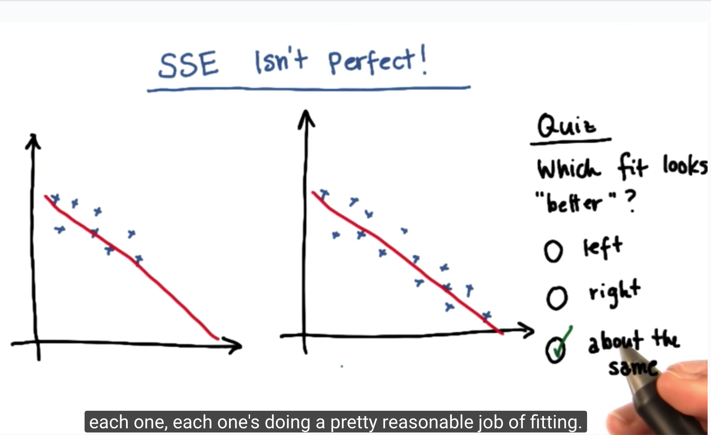
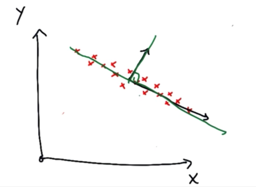
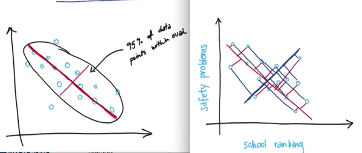

# Intro to MachineLearning


# Supervised Learning 

_已知数据集的**label**，对数据集建模（分类；回归）_

## Naive Bayes

##### Definition：

对于任意的$A_i$类，在$B$条件下发生的概率可以表示成：


选择最大的发生概率，将obejct归为该类别。

[wiki-贝叶斯](https://zh.wikipedia.org/wiki/%E8%B4%9D%E5%8F%B6%E6%96%AF%E5%AE%9A%E7%90%86)   [wiki-条件概率](https://zh.wikipedia.org/wiki/%E6%9D%A1%E4%BB%B6%E6%A6%82%E7%8E%87)


##### Test Score:

Sensitivity: $\frac{TP}{AllT} = \frac{TP}{TP + FN}$ 

Specifity：$\frac {TN}{AllN} = \frac{TN}{TN + FP}$

![scenshot]ML_figure/scenshot.png)


##### Sklearn Method:

```python
from sklearn.naive_bayes import GaussianNB
from sklearn.metrics import accuracy_score
clf = GaussianNB()
t0 = time()
clf.fit(features_train, labels_train)
print "training time:", round(time()-t0, 3), "s"

t1 = time()
labels_pred = clf.predict(features_test)
print "predicting time:", round(time()-t1, 3), "s"

accuracy = accuracy_score(labels_test,labels_pred)
#accuracy = clf.score(features_test, labels_test)
print("The accuracy of Navie Bayer Classifier is %f. " % (accuracy))
```

**Weakness:**

1. 不适用于词组
2. 不考虑词的顺序
3. 条件概率谬论：

> 条件概率的[谬论](https://zh.wikipedia.org/wiki/%E8%B0%AC%E8%AE%BA)是假设*P*（*A*|*B*）大致等于*P*（*B*|*A*）。
>
> 


## SVM

##### **Margin**

maximize  distance to nearest point in neither classes. —> Robust


##### Kernal Tricks

Add **nonlinear feature**  make  SVM **linear separate** points.

| original    |      | transformed |
| ----------- | :--: | ----------- |
| 低维度变量（二维）   |  —>  | 高维变量        |
| 低维度空间 线性不可分 |  —>  | 高维度空间 线性可分  |
| 低维度空间的非线性分离 |  <—  | solution    |


> 

> Example.


##### Parameter-Tradeoff:

* C parameter: Penalty parameter C of the error term.

Control tradeoff between **smooth decision boundary** and **classifying training points correctly**.

Something that's a little straighter, a little bit more straightforward may be actually the better choice, have a better generalization ability.


* gamma parameter:

Kernel coefficient for ‘rbf’, ‘poly’ and ‘sigmoid’. If gamma is ‘auto’ then 1/n_features will be used instead.

>  “gamma是选择RBF函数作为kernel后，该函数自带的一个参数。隐含地决定了数据映射到新的特征空间后的分布，gamma越大，支持向量越少，gamma值越小，支持向量越多。支持向量的个数影响训练与预测的速度。
>
>  这里面大家需要注意的就是gamma的物理意义，大家提到很多的RBF的幅宽，它会影响每个支持向量对应的高斯的作用范围，从而影响泛化性能。我的理解：如果gamma设的太大，会很小，很小的高斯分布长得又高又瘦， 会造成只会作用于支持向量样本附近，对于未知样本分类效果很差，存在训练准确率可以很高，(如果让无穷小，则理论上，高斯核的SVM可以拟合任何非线性数据，但容易过拟合)而[测试](http://lib.csdn.net/base/softwaretest)准确率不高的可能，就是通常说的过训练；而如果设的过小，则会造成平滑效应太大，无法在训练集上得到特别高的准确率，也会影响测试集的准确率。”

[ref-C&gamma](http://scikit-learn.org/stable/auto_examples/svm/plot_rbf_parameters.html) [ref-gamma](http://blog.csdn.net/lujiandong1/article/details/46386201)


##### Strength: 

1. clear margin of separator—> reduce generalization error/Robust

2. kernel tricks

3. torelate individual outliers

   

   ​

##### Weakness：

1. not work well in large dataset: training time happens to be cubic in size of the data set.
2. not work well with lots of noise: if class are very overlapping, you have to count independent evidence.


## Decision Trees

##### Definition:


##### Parameter：

* min_sample_split: 节点最小可拆分的sample数

Too samll min_sample_split counld probably overfit.


##### How and Where to split

Find variable and split points along those variables that’s going to make subsets that are as pure as possible. Repeating that process recursively.

**Entropy**(熵): measure of impurity in a bunch of examples 

$Entropy = \sum_{i}^{n} (P_i) * log_2(P_i)$ 

(different log base can change the maximal value of entropy)

|                                          | entropy | purity |
| ---------------------------------------- | ------- | ------ |
| all examples are same class              | 0       | 1      |
| examples are everyly split between classes | 1       | 0      |

**IG**(Information Gain 信息增益)：decide which variable to split and how by maximizing information gain 

if spliting by $variable_i$  counld get max IG, then use $variable_i$ to split.

$IG = Entropy(parent) - [weight]*Entropy(children) $


## Adaboost（Adaptive Boosting）

##### Theory:

[ref-theory](http://blog.csdn.net/v_july_v/article/details/40718799)

> 它的自适应在于：前一个基本分类器分错的样本会得到加强，加权后的全体样本再次被用来训练下一个基本分类器。同时，在每一轮中加入一个新的弱分类器，直到达到某个预定的足够小的错误率或达到预先指定的最大迭代次数。
>
>  具体说来，整个Adaboost 迭代算法就3步：
>
> 1. 初始化训练数据的权值分布。如果有N个样本，则每一个训练样本最开始时都被赋予相同的权值：1/N。
> 2. 训练弱分类器。具体训练过程中，如果某个样本点已经被准确地分类，那么在构造下一个训练集中，它的权值就被降低；相反，如果某个样本点没有被准确地分类，那么它的权值就得到提高。然后，权值更新过的样本集被用于训练下一个分类器，整个训练过程如此迭代地进行下去。
> 3. 将各个训练得到的弱分类器组合成强分类器。各个弱分类器的训练过程结束后，加大分类误差率小的弱分类器的权重，使其在最终的分类函数中起着较大的决定作用，而降低分类误差率大的弱分类器的权重，使其在最终的分类函数中起着较小的决定作用。换言之，误差率低的弱分类器在最终分类器中占的权重较大，否则较小。


## Regression

##### Methods of Minimizing Error:[需要修正]

* OLS (ordinary least square) 普通最小二乘法

  $SSE = \sum_{all points} (actual - predicted)^2$

  sum of square error (唯一解) 优于 sum of absolute error (多解)

* Gradient descent 梯度下降法


##### Weakness of OLS:

more data —> bigger SSE



##### R² of Regression

R² is an element of [0, 1] and represents the proportion of variability in Y that may be attributed to some linear combination of the regressors (explanatory variables) in X.

用$R^2$ 判定模型的好坏，不受data number影响。

```python
print "r-square score: ", reg.score(ages, network)
print "slope: ", reg.coef_
print "intercept: ", reg.intercept_
```


##### Sensitive to Outliers

if it falls in the *training set*, it can have a significant effect on the *slope/intercept*. 

if it falls in the *test set*, it can make the *score much lower* than it would otherwise be. 

(Reduce outliers influence —> Outliers)


## Supervised Classification VS Regression

| property          | supervised classification | regression          |
| ----------------- | ------------------------- | ------------------- |
| output type       | discrete (class label)    | continuous (number) |
| what try to find? | decision boundary         | "best fit line"     |
| evaluation        | accuracy                  | SSE or R²           |


# Unsurpervised Learning

不知数据集的**label**，对数据集建模（聚类）

## Clustering

##### kmeans 

[ref-sklearn](http://scikit-learn.org/stable/modules/clustering.html)

**Priciple**

> 1. add center points（randomly）
> 2. assign points
> 3. reassign center points
> 4. assign points
> 5. repeat {3. 4. } (optimize) until center points don’t change

Weakness:

1. 随机起始中心点可能会影响分类结果

   > example1.
   >
   > 
   >
   > example2.

   Fix method: tune parameter **n_init**

   执行多次，择优


# Important Tricks

## Outliers

| cause of outliers                | process              |
| -------------------------------- | -------------------- |
| sensor malfunction（usually zero） | ignore               |
| data entry error                 | ignore               |
| freak event                      | **Pay Attention!!!** |

##### Outlier Detection & Rejection

1. train
2. remove points with large residual error (like: top 10%)
3. train again
4. repeat 2. 3.

Visulization is a good method to detect outliers.


## Feature Scaling

##### Dealing What Problem：

当features不在一个量级时，feature的权重受很大影响，应进行scale.

##### Formula:

$X_{scaled} = \frac{X-X_{min}}{X_{max}-X_{min}}$    $(0 \le X_{scaled} \le 1)$

##### Example：

> Try to decide Chris' t-shirt size.
>
> Before scaled: Chris' figure size(height+weight = 146.1) is closer to Sarah(120.2) than Cameron(180.9), which is contrary to intuition.
>
> After scaled:  Chris' figure size(height+weight = 1+0.417 =1.417) is closer to Cameron( 0.778+1 = 1.778)  than Sarah(0), match our intuition.
>
> 

##### Weakness: 

outlier can mess up rescaling, $X_{min}$ or $ X_{max}$ may have extreme value.

##### Advantages: 

get reliable number

##### Sklearn Method:

```python
from sklearn.preprocessing import MinMaxScaler
import numpy as np
X_train = np.array([[ 1., -1.,  2.], 	# using flaot!!!
                    [ 2.,  0.,  0.],
                    [ 0.,  1., -1.]])
min_max_scaler = preprocessing.MinMaxScaler()
X_train_minmax = min_max_scaler.fit_transform(X_train)
X_train_minmax
#-----------------------------output------------------------------------
#array([[ 0.5       ,  0.        ,  1.        ],
#       [ 1.        ,  0.5       ,  0.33333333],
#       [ 0.        ,  1.        ,  0.        ]])
```

##### Effecting Algorithms

* SVM with RBF kernel
* K-Means cluster

considering the distance between points


## Text Learning

> "The raw data, a sequence of symbols cannot be fed directly to the algorithms themselves as most of them expect numerical feature vectors with a fixed size rather than the raw text documents with variable length."

##### Bag of Words:

A corpus of documents can thus be represented by a matrix with one row per document and one column per token (e.g. word) occurring in the corpus.

We call **vectorization** the general process of turning a collection of text documents into numerical feature vectors. This specific strategy (tokenization, counting and normalization) is called the **Bag of Words** or “Bag of n-grams” representation. 


###### Weakness of Bag of Words:

1. 不考虑word出现的顺序
2. 如果文章重复2遍，那么count*2
3. 不能识别词组


###### Sklearn of  "Bag of Words"

```python
from sklearn.feature_extraction.text import CountVectorizer
vectorizer = CountVectorizer()
corpus = [
     'This is the first document.',
     'This is the second second document.',
     'And the third one.',
     'Is this the first document?' ]
bag_of_words = vectorizer.fit_transform(corpus) #fit, then transform
bag_of_words.toarray()
#------------------------------output--------------------------------------
#array([[0, 1, 1, 1, 0, 0, 1, 0, 1],
#       [0, 1, 0, 1, 0, 2, 1, 0, 1],
#       [1, 0, 0, 0, 1, 0, 1, 1, 0],
#       [0, 1, 1, 1, 0, 0, 1, 0, 1]]...)

#get feature name or column name
vectorizer.get_feature_names()

#mapping from feature name to column index 
vectorizer.vocabulary_.get('document')

```


###### TF-IDF

> "TF-IDF的主要思想是：如果某个词或短语在一篇文章中出现的频率TF高，并且在其他文章中很少出现，则认为此词或者短语具有很好的类别区分能力，适合用来分类。TF-IDF倾向于过滤掉常见的词语，保留重要的词语。" [ref](https://zh.wikipedia.org/wiki/TF-IDF)

TF-IDF 优于 term count，解决weakness 2.

TF-IDF = TF * IDF，TF词频（Term Frequency），IDF逆向文件频率（Inverse Document Frequency）是一个词语普遍重要性的度量。

$tf_{i,j} = \frac{n_{i,j}}{\sum _{k} n_{k,j}}$  （$n_{i,j}$在文件$d_j$中出现的次数，分母是文件$d_j$中所有字词出现次数之和）

$idf_i = \log{\frac {|D|}{ |\{j : t_i \in d_j\}| }}$  （$|D|$：语料库中的文件总数；$|\{j : t_i \in d_j\}|$: 包含词语$t_j$的文件数目，避免词语不在语料库，导致分母为零，一般使用$1+|\{j : t_i \in d_j\}|$ )

$tfidf_{i,j} = tf_{i,j} * idf_{i}$


###### Sklearn Method of TF-IDF:

```python
from sklearn.feature_extraction.text import TfidfVectorizer
vectorizer = TfidfVectorizer(stop_words = "english")  #use sklearn stopwords
word_data_tfidf = vectorizer.fit_transform(word_data)
```


##### Remove Stopwords: 

stopwords：low-information, highly frequency word (like "I", "a", "you").

* use sklearn

  transformer = TfidfVectorizer(stop_words = 'english')`

* use nltk


##### Stemmer：

把多个同义或仅轻微区别的字词 词干化，变成一个词。


###### Sklearn Method of "SnowballStemmer"

[ref-stemmers](http://www.nltk.org/howto/stem.html)

```python
from nltk.stem.snowball import SnowballStemmer
#See which languages are supported.
print(" ".join(SnowballStemmer.languages))
#----------------------------------output--------------------------------------
#danish dutch english finnish french german hungarian italian
#norwegian porter portuguese romanian russian spanish swedish

stemmer = SnowballStemmer("english")
stemmer2 = SnowballStemmer("english", ignore_stopwords=True)
print(stemmer.stem("having"))
#----------------------------------output--------------------------------------
#have
print(stemmer2.stem("having"))
#----------------------------------output--------------------------------------
#having

```


##### Text Learning Order：

1. stem
2. remove stopwords
3. bag of word 

if using sklearn method, step2 and step3 could merge into one step. Example: `vectorizer = TfidfVectorizer(stop_words = "english") ` 


## Feature Selection

##### Dealing What Problem: 

Features (attempt to access information) $\ne$ Information (we want this !)

Ignore features that 

* are noisy
* cause overfitting
* strongly related with a feature that's already present
* additional feature slow down training/testing process


##### Sklearn Methods of Select univariate features:

[ref-sklearn](http://scikit-learn.org/stable/modules/feature_selection.html#univariate-feature-selection)

| method           | detail                                   |
| ---------------- | ---------------------------------------- |
| SelectPercentile | selects the X% of features that are most powerful |
| SelectKBest      | selects the K features that are most powerful |

For instance, we can perform a $\chi^2$ test to the samples to retrieve only the two best features as follows:

```python

from sklearn.datasets import load_iris
from sklearn.feature_selection import SelectKBest
from sklearn.feature_selection import chi2
iris = load_iris()
X, y = iris.data, iris.target
X.shape
#--------------------------------output---------------------------------------
(150, 4)

X_new = SelectKBest(chi2, k=2).fit_transform(X, y) #chi2 作为评判标准
X_new.shape
#--------------------------------output---------------------------------------
(150, 2)
```

For instance, we can use a ANOVA F-value  to the samples to retrieve only top 10% best features as follows:

```python
from sklearn.feature_selection import SelectPercentile, f_classif
vectorizer = TfidfVectorizer(max_df=0.5, stop_words='english')
features_train_transformed = vectorizer.fit_transform(feature_train)
features_test_transformed = vectorizer.transform(feature_test)

selector = SelectPercentile(f_classif, percentile = 10) #f_classif: Compute the ANOVA F-value for the provided sample.
selector.fit(features_train_transformed, label_train)
features_train_transformed = selector.transform(features_train_transformed).toarray()
features_test_transformed = selector.transform(features_test_transformed).toarray()
```

max_df: ignore terms that have a document frequency strictly higher than the given threshold


##### Bias - Variance Dilemma and No. of Features

| high bias                                | high variance                            |
| :--------------------------------------- | ---------------------------------------- |
| pay littile attention to data            | pay too much attention to data (does not generalize well) |
| over simplified                          | over fits                                |
| high error on training set(low $r^2$, large SSE) | much higher error on test set than training set |
| few features used                        | many features, carefully optimized performace on training data |


##### Regularization in Regression - Lasso

**Principle:**

Lasso regression minimize   $SSE + \lambda |\beta|$         ($\lambda$: parameter; $\beta$: coefficients of regression)

Lasso regression add  features in one at a time , if new feature doesn’t improve fit enough to outweight the penalty term of including that feature, then it won’t be added.

**Sklearn method of Lasso:**

```python
import sklearn.linear_model.Lasso
regression = Lasso()
regression.fit(features, label)
regression.predict([2, 4])
print regression.coef_ #if output equal 0, this feature shouldn't be added.
```


##### Find Bug Feature： 

make model higher accuracy and 高精准又不过拟合

1. 例：发现有且仅有一个feature对label起决定性作用
2. find feature index, importance and name
3. This feature(or word) seems like an outlier in a certain sense, so let’s remove it and refit


## Feature Transformation-PCA

##### Dimentionality of Data


Treat deviation as noise:


PCA in particular specializes on just **shifts** and **rotation** for the coordinate system.



##### Example of PCA Process:

> Background: we have following 4 features to predict house prices.
>
> square footage; no. of rooms; school ranking; neighborhood safety


###### Measuranle VS Latent Features

*Question：Given the feature of a house, what is its price?*

Measuranle Features:

1. square footage     
2. no. of rooms
3. school ranking
4. neighborhood safety

transfrom to latent features:

1. house size
2. neighborhood


###### How to Press Infromation

*Question: How best to condense our 4 features to 2, sotaht we really get to the heart of the information?*

Hypothesize a smaller no. of features actually driving the patterns, try making a **composite feature(principle component)** that are more directly probes the underlying phenomenon.


###### How to Determine the Principal Component

Principal component of a dataset is the direction that has the largest variance.

max variance —> max information;         minimize distance —> minimize infroamtion loss





##### Usage

As a genernal algorithm for feature transformation.


##### When to use PCA

1. Latent features driving the pattern in data
2. dimensionality reduction
   1. visualize high-dimentionality data
   2. reduce noise
   3. make other algorithms(regression/classification) work better with fewer inputs.


##### How to Select No. of PCs

Train on different number of PCs, and see how accuracy responds — cut off when it becomes appearent that adding more PCs doesn’t buy you much more discrimination.


##### PCA in Sklearn

[pca-sklearn](http://scikit-learn.org/stable/modules/generated/sklearn.decomposition.PCA.html#sklearn-decomposition-pca) [pca-face-recognization](http://scikit-learn.org/stable/auto_examples/applications/face_recognition.html#faces-recognition-example-using-eigenfaces-and-svms)

```python
from sklearn.decomposition import PCA
pca = PCA(n_components=2)
pca.fit(X_train)
pca.transform(X_train)
pca.transform(X_test)
```


## Validation

[wiki](https://en.wikipedia.org/wiki/Cross-validation_(statistics)) 

##### Cross Validation

The goal of cross validation is to define a dataset to "test" the model in the training phase (i.e., the validation dataset), in order to limit problems like overfitting, give an insight on how the model will generalize to an independent dataset (i.e., an unknown dataset, for instance from a real problem), etc.

##### K-fold Cross Validation

more times, more accuracy.

1. Run K seperate learning experiments
   1. Pick one of those k subset as your testing set. The remaining k-1 bins are put together into you training set
   2. Train algorithm. 
   3. Test performance on testing set. 
2. Average test results from those k experiments


##### GridSearchCV 

is a way of systematically working through multiple combinations of parameter tunes, cross-validating as it goes to determine which tune gives the best performance. 

Here's an example from the sklearn documentation:

```python
parameters = {'kernel':('linear', 'rbf'), 'C':[1, 10]}
svr = svm.SVC()
# "parameters" generates a grid of parameter combinations to try.
clf = grid_search.GridSearchCV(svr, parameters) 
# "fit" tries all the parameter combinations, and returns a fitted classifier
clf.fit(iris.data, iris.target) 
clf.best_params_
```


## Evaluation Metrics

##### Shortages of Accuracy:

$\displaystyle \mathrm{Accuracy} = \frac{\mathrm{no.\ of\ items\ in\  a\ class\ labeled\ correctly }}{\mathrm{all\ items\ in\ that\ class}}$   not ideal for skewed classes


##### Alternative evaluation:

Facing skewed classes, using Recall, Precision and F1 score.

**Recall** : Out of all the items that are truly positive, how many were correctly classified as positive. Or simply, how many positive items were 'recalled' from the dataset.

$\displaystyle \mathrm{Recall} = \frac{\mathrm {True\ Positive}}{\mathrm {True\ Positive+False\ Negaticve}}$

**Precision**:  Out of all the items labeled as positive, how many truly belong to the positive class.

$\displaystyle \mathrm{Precision}=\frac{\mathrm{True\ Positive}}{\mathrm{True\ Positive+False\ Positive}}$

**F1 Score**:  can be interpreted as a weighted average of the [Precision and Recall](https://en.wikipedia.org/wiki/Precision_and_recall), where an F1 score reaches its best value at 1 and worst at 0.

${\displaystyle F_{1}=2\cdot {\frac {1}{{\tfrac {1}{\mathrm {Recall} }}+{\tfrac {1}{\mathrm {Precision} }}}}=2\cdot {\frac {\mathrm {Precision} \cdot \mathrm {Recall} }{\mathrm {Precision} +\mathrm {Recall} }}}$

[ref](https://argcv.com/articles/1036.c) [wiki](https://en.wikipedia.org/wiki/F1_score)


# Process of ML

Dataset/Question —> Features —> ALgorithms —> Evaluation


# PS:

## One way to Speed up an algorithm

train it on a smaller training dataset

```python
features_train = features_train[:len(features_train)/100] 
labels_train = labels_train[:len(labels_train)/100] 
```


## Data Set 

usually more training data —>better accuracy  than  fine tuned algorithm

##### Type of Data

| Type of data |                                          |
| ------------ | ---------------------------------------- |
| numerical    | numerical value (numbers)                |
| categorical  | limited number of discrete value (category) |
| time series  | temporal value (date, timestamp)         |
| text         | words                                    |

| Type of data |                              |
| ------------ | ---------------------------- |
| continuous   | value之间可以比较大小，有一定的order（age） |
| discrete     | value是一种属性或代号（id）            |


## Other Tips

##### Delete Punctuation

`text_string = content[1].translate(string.maketrans("", ""), string.punctuation)`

```python
from string import maketrans  
intab = "aeiou"
outtab = "12345"
trantab = maketrans(intab, outtab) #建立 字符替换公式

s = "this is string example... wow!!!"
print s.translate(trantab, 'xm')   #delete 'x' and 'm'
#--------------------------------------output--------------------------------------------
#th3s 3s str3ng 2x1mpl2....w4w!!!
```

[ref](http://www.runoob.com/python/att-string-translate.html)


##### Split by Whitespace not Space

```python
string.split()     #split by whitespace
string.split(" ")  #split by single space
```


##### Add Path

```python
import sys
from time import time
sys.path.append("../tools/") 
```

