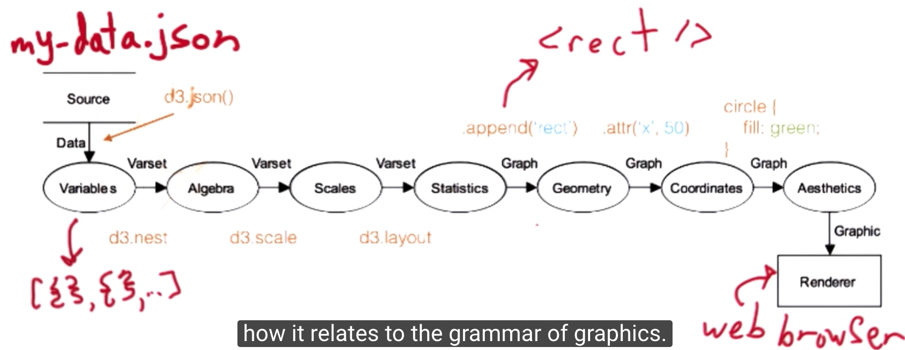

## Data Visualization in Data Analysis


* Quatitative Data
* Categorical Data
  * Nominal (like geographical region)
  * Ordered (popualtion bins, class difficulty)

#### Visual Encodings:

1. planar variables
2. retinal variable( like ,size, orientation, color saturation  ) 

#### 识别度


## Up and Down the Visualization Spectrum


#### DOM


**DOM** (Document Object Model) is a specification, much like html, css, that specifies a common programming interface for html and xml documents.

Once the source of the html is returned from the server, the web browser parses the file and transforms it into a hierarchical object that can accessed programmatically, most often through JavaScript, called the DOM.

D3 binds data to the DOM rather than the source or visual element of the html.


## D3 Module

#### D3 Syntax

##### Select jquery

1. get element by id

   `document.getElementById("footer");` 

2. query selector(css systax)

   


##### 使用d3js模块

**引入d3js**

1. 直接添加  

```html
<!DOCTYPE html>
<html>
<head>
  	<script src="https://d3js.org/d3.v4.min.js"></script>
	<!--或者<script type="text/javascript" src="d3.v2.min.js"></script>-->
</head>
<body> 
```

2. wirte js code in console

```javascript
var script = document.createElement('script')
script.type = 'text/javascript'
script.src = 'https://d3js.org/d3.v3.min.js';
document.head.appendChild(script);
```


**Usage Example**

`var elem = d3.select(".main");`  elem 是一个DOM node.

```javascript
d3.select("element_name") //return first element named "element_name"
d3.selectAll("img") // return all "img"
d3.select(".class_name")  
d3.select("#id_name")

//两级class <a class="navbar-brand logo" id="12345" >
d3.select(".navbar-brand.logo")

//select id of log, then select child img, change logo
d3.select("#header-logo img").attr("alt", "Udacity");

//置空
d3.select(".main").html(null); 
d3.select(".main").html(""); 
```

##### Chain rule

`var elem = d3.select(".navbar");`

`elem.style("background-color", "gray");` 

等价于

`d3.select(".navbar").style("background-color", "gray");` 


#### Map

map data value—>pixel value


SVG 左上角坐标（0，0）。

从 15-90 缩放到 250-0，返回map映射函数。

`var x=d3.scale.log().domain([250,100000]).range([0,600]);`

##### Usage of Creating Axes


#### Data Join

[ref](https://bost.ocks.org/mike/join/) 


##### Load Data

```javascript
d3.tsv(url, row, callback);
// is equivalent to this
d3.tsv(url)
  .row(row)
  .get(callbacl);
```

##### Example


**empty placeholder nodes**, something like a virtual html node that exists in javascript scope or in the console but is not visible on the page, as an SVG element.


blue：row of data.tsv which are not bound to html/svg elements currently on the page.

purple: row of data.tsv which are bound to html/svg elements currently on the page.

red: html/svg elements currently on the page which are not bound to  row of data.tsv.


**refs:**

https://bost.ocks.org/mike/circles/

https://bost.ocks.org/mike/join/

http://alignedleft.com/tutorials/d3/binding-data


## Design Principle


[ref-colorbrewer](http://colorbrewer2.org/#type=sequential&scheme=BuGn&n=3)

[ref-the-gestalt-laws-of-perception](https://www.slideshare.net/luisaepv/the-gestalt-laws-of-perception) 


## Grammar of Graphics





## Dimple Module


##### example

```javascript
// 折线+散点图
// 添加坐标轴，设置时间格式
var myChart = new dimple.chart(svg, data);
var x = myChart.addTimeAxis("x", "year"); 
myChart.addMeasureAxis("y", "attendance");
x.dateParseFormat = "%Y";
x.tickFormat = "%Y";
x.timeInterval = 4;
myChart.addSeries(null, dimple.plot.line);
myChart.addSeries(null, dimple.plot.scatter);
myChart.draw();
```

```javascript
// 气泡图
svg.append('g')
   .attr("class", "bubble")
   .selectAll("circle")
   .data(nested.sort(function(a, b) { 
      return b.values['attendance'] - a.values['attendance'];
   }), key_func)
   .enter()
   .append("circle")
// 气泡的位置及半径
   .attr('cx', function(d) { return d.values['x']; })
   .attr('cy', function(d) { return d.values['y']; })
   .attr('r', function(d) {
        return radius(d.values['attendance']);
   })
```

```javascript
// legend
var legend = svg.append("g")
	.attr("class", "legend")
	.attr("transform","translate(" + (width-100) + "," + 20 +")")
	.selectAll("g")
	.data(["Home Team", "Other"])
	.enter().append("g");
```


## Narrative Strucatures


## Make a Map


##### Projection

利用`.mercator()`投影，三维降到二维

*  preserve equator
* stretch/ sacrifice area near poles


```javascript
//projection, analogous to the scales, convert from logitudes and latitudes into the pixel domain
var projection = d3.geo.mercator();

//construct the SVG objects to render thoes pixels. If a projection is specified, sets the current projection to the specified projection.
var path = d3.geo.path().projection(projection);

var map = svg.selectAll('path')
              .data(geo_data.features)
              .enter()
              .append('path')
              .attr('d', path) // The path variable is actually a function that gets passed the data that is bound to each element in the selection
```

其他：


##### Geojson

"coordinates": [经度，维度]


**circle area**


```javascript

var nested = d3.nest()
               .key(function(d) {
                  return d['date'].getUTCFullYear();})
               .rollup(agg_year)
               .entries(data);
svg.append('g')
   .attr("class", "bubble")
   .selectAll("circle")
   .data(nested.sort(function(a, b) { 
      return b.values['attendance'] - a.values['attendance']; }), key_func)
   .enter()
   .append("circle")
   .attr('cx', function(d) { return d.values['x']; })
   .attr('cy', function(d) { return d.values['y']; })
   .attr('r', function(d) {
        return radius(d.values['attendance']);
   });
```


##### 交互


```javascript
// 一次出现一个 year对应的图
function update(year) {
          var filtered = nested.filter(function(d) {
              return new Date(d['key']).getUTCFullYear() === year;
          });

          d3.select("h2")
            .text("World Cup " + year);

          var circles = svg.selectAll('circle')
                           .data(filtered, key_func);

          circles.exit().remove();

          circles.enter()
                 .append("circle")
                 .transition()
                 .duration(500)
                 .attr('cx', function(d) { return d.values['x']; })
                 .attr('cy', function(d) { return d.values['y']; })
                 .attr('r', function(d) {
                    return radius(d.values['attendance']);
                 });

          var countries = filtered[0].values['teams'];

          function update_countries(d) {
              if(countries.indexOf(d.properties.name) !== -1) {
                  return "lightBlue";
              } else {
                  return 'white';
              }
          }

          svg.selectAll('path')
             .transition()
             .duration(500)
             .style('fill', update_countries)
             .style('stroke', update_countries);

      }
```
```javascript
// 按year设置buttons
var years = [];
        for(var i = 1930; i < 2015; i += 4) {
          if(i !== 1942 && i !== 1946) {
            years.push(i);
          };
        }
        var buttons = d3.select("body")
                        .append("div")
                        .attr("class", "years_buttons")
                        .selectAll("div")
                        .data(years)
                        .enter()
                        .append("div")
                        .text(function(d){
                            return d;
                        });
```

```javascript
// 先依次把每年的图 展示一遍（隔1000ms）；然后根据点击button的year展示相应年份的数据（if条件成立）。
var year_interval = setInterval(function() {
            update(years[year_idx]);

            year_idx++;

            if(year_idx >= years.length) {
                clearInterval(year_interval);

                var buttons = d3.select("body")
                        .append("div")
                        .attr("class", "years_buttons")
                        .selectAll("div")
                        .data(years)
                        .enter()
                        .append("div")
                        .text(function(d) {
                            return d;
                        });

                buttons.on("click", function(d) {
                    d3.select(".years_buttons")
                      .selectAll("div")
                      .transition()
                      .duration(500)
                      .style("color", "black")
                      .style("background", "rgb(251, 201, 127)");

                    d3.select(this)
                      .transition()
                      .duration(500)
                      .style("background", "lightBlue")
                      .style("color", "white");
                    update(d);
                });
            }
          }, 1000);
```

##### Martini Narrative Strucature


## PS:

##### start local server

 `python -m SimpleHTTPServer 8000`

##### http protocol

http protocol —host — port—file

way to find address— apartment—unit—file


##### Strict equality


##### SVG 

**Coordinate Space**


**g-element**


http://tutorials.jenkov.com/svg/g-element.html