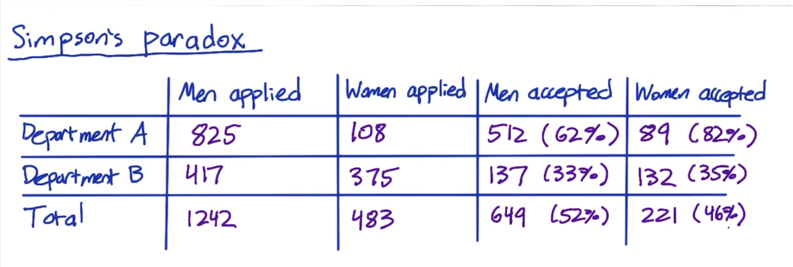

# A/B test

### can't do:

1. 无法用在新体验上；
2. 时间是一个问题


A/B test 可以给大量 定量的数据；其他技术可以给定性数据，作为补充 .

When you're doing A/B testing , the goal really is to determine whether or not this new product or this new feature is something taht users will take. And so the goal in A/B testing is to design an experiment, that's going to be robust and give you repeatable results, so that you can actually make goos decision about whether or not to actucally launch taht product or feature.


### Metrics Define:

measure the usability of button点击pv/pv; —> click through of rate  

how often went into second page点击uv/uv—> click through of probability  


## 二项分布的估计：

#### 定义

二项分布，即重复n次的[伯努利试验](http://baike.baidu.com/item/%E4%BC%AF%E5%8A%AA%E5%88%A9%E8%AF%95%E9%AA%8C)，用ξ表示[随机试验](http://baike.baidu.com/item/%E9%9A%8F%E6%9C%BA%E8%AF%95%E9%AA%8C)的结果。二项分布公式如果事件发生的[概率](http://baike.baidu.com/item/%E6%A6%82%E7%8E%87)是P,则不发生的概率q=1-p，n次[独立重复试验](http://baike.baidu.com/item/%E7%8B%AC%E7%AB%8B%E9%87%8D%E5%A4%8D%E8%AF%95%E9%AA%8C)中发生K次的概率是$P(ξ=K)= C(n,k) * p^k * (1-p)^{(n-k)}$, 其中P称为成功概率，其中q=1-p。

事件发生次数(the distribution defined as the total number of sucesses)的期望和标准差：

$μ= n*p$

$σ=\sqrt{n*p*(1-p)} $

事件发生率(the fraction or proportion of successes)的期望和标准差：

$μ_p= p$

$σ_p=SE=\sqrt{\frac{p*(1-p)}{n}}$ 也叫率的标准误

[百度百科](http://baike.baidu.com/item/%E4%BA%8C%E9%A1%B9%E5%88%86%E5%B8%83)


#### Pooled SE

$\hat{d} = \hat{p_{exp}}-\hat{p_{cont}}$ 

$\hat{p_{pool}} =  \frac{X_{cont}+X_{exp}}{N_{cont}+N_{exp}}$

$SE_{pool} = \sqrt{\hat{p_{pool} }*(1-\hat{p_{pool})} (\frac{1}{N_{cont}}+\frac{1}{N_{exp}}) }$

$H_0: d=0$   $\hat{d}$~$N(0,SE_{pool})$ 

if $\hat{d} \gt d+1.96*SE_{pool} $ or if $\hat{d} \lt d-1.96*SE_{pool} $  , reject null。 our difference represents a statistically significant difference.


#### Calculating confidence interval 


## Size vs Power trade-off 

$H_0$:no effect 

第一类错误：α=P(reject null|null true)   

第二类错误：β=P(retain null|null false)  

> "1-α is the chance to accept the null hypothesis when it is true . This is called **reliability** or **confidence level**. 1-β is the chance to reject the null hypothesis when it is not true. This is called **power**."  by -[ref]("https://vwo.com/blog/how-to-calculate-ab-test-sample-size/")
>
> "Statistics textbooks frequently define **power** to mean the same thing as **sensitivity**, that is, **1 - β**. However, conversationally power often means the probability that your test draws the correct conclusions, and this probability depends on both α and β. In this course, we'll use the second definition, and we'll use sensitivity to refer to 1 - β." 									    by-DAND 


**Figure Example** : *sampling distributions for the difference between two proportions with p1=p2=.04, n1=n2=5,000(red line) and p1=.04, p2=.05, n1=n2=5,000 (blue line), with a one-sided test and a reliability of .95.* 


* test results, on the right side of the gray line (marking the significance area) are regarded as significant.
* All observations on the left side of the gray line are regarded as *not* significant.
* The area under the ‘blue’ distribution left of the significance line is β, the chance to not reject $H_0$ when $H_0$ is in fact not true (a false decision), and it covers 22% of that distribution.
* That makes the area under the blue distribution to the right of the significance line the power area and this area covers 78% of the sampling distribution. The probability to reject $H_0$ when $H_0$ is not true, a correct decision.
* So the power(sensitivity) of this specific test with its specific parameters is .78.


#### How to increate sensitivity:

1. increase sample size n:  SE减小，分布更集中


Change sensitivity(1-β) from 0.78 to 0.96.


2. decrease α：gray line 左移，β减少


Change sensitivity(1-β)  from 0.78 to 0.87.


## statistical significant  & practical significant 

已知：$N_{cont}=10072$ , $N_{exp}=9886$, $X_{cont}=974$, $X_{exp}=1242$, $d_{min}=0.02$, confidence level = 95%(two-tail) 

 判断是否 statistical significant, practical significant ?


$\hat{ d}=\frac{X_{exp}}{N_exp}-\frac{X_{cont}}{N_{cont}}$ =0.0289

$\hat{ P_{pool}} =\frac{X_{cont}+X_{exp}}{N_{cont}+N_{exp}}= \frac{974+1242}{10072+9886}=0.111$ 

$ SE=\sqrt{\hat{p_{pool}}*(1-\hat{p_{pool})} (\frac{1}{N_{cont}}+\frac{1}{N_{exp}}) }= \sqrt{0.111*(1-0.111)(\frac{1}{10072}+\frac{1}{9886})}=0.00445$ 

$margin =SE*1.95 =0.0087$ 

confidence interval of $\hat{d}$:  ($\hat{d}-margin,\hat{d}+margin) = (0.0202,0.0376) $ 

* 0 is not included in this confidence interval, so statistical significant.
* Luckly! $(-d_{min},d_{min})$ is out of confidence interval, so pratical significant.

I choose to launch.


case 1, 上述类型；

case 2、3，不够显著，没有达到min difference的阈值；

case 4、5、6的 置信区间落在$(-d_{min},d_{min})$


## Metrics for Experiments

### Choose and Characterizing Metrics:

##### Metrics:

* Sanity checking metrics
* evaluation metrics

##### Steps of definition:

1. come up with high level concept for a metric(like "active users")
2. figure out all of the nitty gritty details( how do you define active is?)
3. take all of these individual data measurements, and now you need to summarize them into a  single metric(sum ,average) 

if you have multiple metrics, you can create a composite metric(like "OEC"-overall evaluation criterion).


Difficult metrics:

* Don't have access to data
* Takes too long


##### Techniques to Gather Addatitional Data

[Additional Techniques](https://storage.googleapis.com/supplemental_media/udacityu/3954679115/additional_techniques.pdf)


##### Categories of Summary Metrics

1. Count and Sum;
2. Means, medians and  percentiles;
3. Rates and Probabilities;
4. Ratio


### Characteristic of Metrics：

##### sensitivity and robust

Using A/A tests to determine if they're too sensitive

##### Absolute vs Relative Difference

The relative difference is the absolute difference divided by the control metric.

> Relative differences in probabilities
>
> For probability metrics, people often use percentage points to refer to absolute differences and percentages to refer to relative differences. For example, if your control click-through-probability were 5%, and your experiment click-through-probability were 7%, the absolute difference would be 2 percentage points, and the relative difference would be 40 percent. However, sometimes people will refer to the absolute difference as a 2 percent change, so if someone gives you a percentage, it's important to clarify whether they mean a relative or absolute difference!


### Variance of Metrics:


##### Variance of Complicated metrics

the distribution of some complicated metrics can be very weird :

1. **non-parametric** methods(analysis data without assumption about what distribution is). **sign-test**
2. empirical estimate variance

##### Empirical estimate variance

Why use empirical esitimate variance?

1. weird distribution


2. even for some simple metrics, the analytical estimate of the variance ended up being an underestimate.

##### Example case:

 *A/A tests on click-through-probability*: 20 experiments, 50 users on each group. [course-video](https://classroom.udacity.com/nanodegrees/nd002/parts/00213454013/modules/411033896375460/lessons/4028708543/concepts/39546791430923) [data](https://docs.google.com/spreadsheets/d/17wWNY2jkDlG9BDMYQq2l-ku_8HGajXuF2Zvy__dBEL4/edit#gid=0) 

**We expect (A/A test 的第一种用途) :**

1. Out of 20 experiments, we expect to see one significant difference on average(20*5%=1).

2. The differences are following a normal distribution.

   

   

**Estimate variance (A/A test 的第一种用途) )**

Empirical: standard deviation of "diff" =0.059, margin of error=$SD*Z^*=0.059*1.96=0.116$ 

Analyticall:$ SE=\sqrt{\hat{p_{pool}}*(1-\hat{p_{pool})} (\frac{1}{N_{cont}}+\frac{1}{N_{exp}}) }$ , marigin of error=$SE*Z^*$

**Directly estimate confidence interval:**

Method1:  take all "diff", put them in order. keep the middle 90%。In this case ,we get a the 90% confidence interval (-0.1,+0.06). 

Method2: $SE*1.65=0.097$, if  the true difference were 0 that would give us a confifence interval(-0.097,+0.097).

These two methods give two answers, mainly due to only having 20 data points.


##### Usage of A/A tests:

1. Compare result to what you expect(sanity check)

* if your experiment is complicated, A/A is a good test of your system.
* if **bootstrap esitimate** is agreeing with your do analytical estimate,  you can probably move on. if not, you may want to consider running a lot of A/A tests.

2. Esitimate variance and calculate confidence

3. Directly esitimate confidence interval of "diff"

   ​


## Design an Experiment


### Unit of diversion— Choose "subject":

| Unit of diversion(Common) |                                          |
| ------------------------- | ---------------------------------------- |
| User id                   | 1. stable,unchanging; 2. Personally identifi |
| Anonymous id(cookie)      | 1. change when you switch brower or device; 2. Users can clear cookies; |
| Event                     | 1. No consistent experience; 2. Use only for non-user-visible changes |
| **less common**           |                                          |
| Device id                 | 1. only available for mobile; 2. tied to specific device; 3. unchangable for user; 4. personally identifiable |
| IP address                | 1. chaneg when location changes          |


##### How to choose :

1. enough user consistency
   * userID,  the user gets a consistent experiment. test an change that across sign in, sign out border, then userID doesn't work, cookie is better.
   * if user can't see changes, use event
   * User's visibility is one consideration as to whether you want to use cookie or userID. The other thing is what you want to measure(like learning effect).


2. ethical considerations


3. variability of metric

   empirical variability is sometimes much higher than analytical variability.

   * unit of analysis is basically whatever the denominator of your metric is .

   * When you're doing event based diversion, every single event is different random draw, and so your independence assumption is actually valid.

   * when you’re doing cookie or user id based diversion, that independent assumption is no longer valid because you’re actually diverting groups of events. And so they're actually correlated together. and that will increase your variability greatly(empirical).

     **Example**:

     

##### Choose "population"

##### Inter-user vs Intra-user

inter-user 用户分配在两组；

intra-user 用户前后时间在两组实验中。

##### Reason using Target population：

1. restrict number of users in experiment for some reasons
2. don't want gloable population dilute efect of experiment

##### Population vs Cohort

population VS cohort(队列)： established subset of population 

Cohort, typically, means people who enter the experiment at the same time. 

通常仅在观察用户稳定性时使用队列, 了解更改对用户的影响。


### Size

reduce size for some reasons

example case:


code

### Duration


## Analyzing Results

### Sanity Checks

reason: 确保实验正确执行

two kinds:

1. population sizing metrics based on unit of diversion. checking experiment population and control population are comparable.


2. invariants, other metrics shouldn’t change.


**Checking invariant**

Total control > Total experiment, is difference within experctation?

compute confidence interval.

look into data day by day. It's a overall problem rather than a problem on a specific day.


##### Single Metric

click through rate 非二项分布，Poisson分布，用emprical variacne.

the confidence interval does not include the pratical signifiacance boundary —> launch.


[sign-test](http://graphpad.com/quickcalcs/binomial1.cfm) is a special case of the binomial csae where your theory is that the two outcomes have equal probabilities.

The probability of "getting 7 days with positive by chance" is 0.0156, less than 0.05


**Effect Size test(evaluation metrics 假设检验) diff 显著，Sign test 不显著**

只要置信区间不包含0，就statistically significant. 如果$d_{min}$不在置信区间内，practically significant.

Sign test(non-parametric test) has lower power than Effect size test, that's the price pay for not making any assumptions. look deeper


[辛普森悖论]()  each subgroups diff不显著，the mix of subgroups diff显著.



##### Multiple Metrics

the more metrics use, the more possible to see significance by chance.


Overall chance of an error $α_{overall}=1-(1-α_{individual})^n$ 

Solution Method:

1. Assume independence 

   set targeted $α_{overall}$, then compute $α_{individual}$ 

2. Bonferroni correction 

   $α_{individual}= \frac{α_{overall}}{n}$

   **simple；no assumption; conservative (metrics correlated  tend to move at the same time).**

[Forum](https://discussions.youdaxue.com/t/topic/32504/18)

> 假设只做一次检验时的显著性水平为0.05，即接受备择假设的允许犯错概率为5%，那么保留元假设的犯错概率就是95%. 如果在同一个数据集上做了n次**独立检验**，那么n次都不犯第一类错误的概率是（0.95）^n，于是这n次中至少有一次犯了第一类错误的概率是1－（0.95）^n. 当n增大时，显然1－（0.95）^n也会增大，例如当n＝10，1－（0.95）^10=0.40, 即对同一数据集做10次检验假设的犯错概率上升为40%，远远大于实际可以忍受的5%的犯错概率。解决这个问题的措施，通常是对单次检验的显著性水平做修正，最常用的是Bonferroni correction。在这一修正下，单次检验的显著性水平被设定为总体的显著性水平（如0.05）的1/n （如n＝10，则单次检验的接受概率变为0.005）。
>
> 从上面的解释可以看出，Bonferroni校正主要适用于n次独立检验。但是本试验中的总转化率和净转化率并非是独立的，而是相关联的，因此使用Bonferroni校正会使得试验结果过于保守，不建议使用哦~


single metric test is significant, but Bonferroni correction is not. Launch? or not?

1. Find more sophisticated method

2. Judgment call

3. Control probability that any metric shows a false positive

    $α_{overall}$, family wise error rate(FWER)

4. Control false discovery rate(FDR)

   $FDR=E[\frac{false\ positive}{rejections}]$


##### Bonferroni correction 

>  But if we need just some of our metrics to be statistically significant to be able to make a decision it is a good idea to use the Bonferroni correction. [discuss-1](https://discussions.udacity.com/t/when-to-use-bonferroni-correction/37713/5)

[discuss-2](https://discussions.udacity.com/t/bonferroni-correction/201344/19)


## Lauch or not

Once figured out which metrics have significant changes, what comes next?

#### Two questions：

1. do you understand change;
2. do you want to launch the changes?
   1. 有没有统计显著性，实际显著性
   2. 变化对用户的影响
   3. worth it

#### Gotchas 

The effect may actually flatten out as you ramp up the change.


## Ref：

 [‘**Gpower’**](http://www.psycho.uni-duesseldorf.de/abteilungen/aap/gpower3/) 

[sample size caculator](http://www.evanmiller.org/ab-testing/sample-size.html)

```javascript
//based on https://www.optimizely.com/resources/sample-size-calculator/
function getSampleSize() {
    let effect = 0.05; // Minimum Detectable Effect
    let significance = 0.95; // Statistical Significance
    let conversion = 0.05; // Baseline Conversion Rate

    let c = conversion - (conversion * effect);
    let p = Math.abs(conversion * effect);
    let o = conversion * (1 - conversion) + c * (1 - c);
    let n = 2 * significance * o * Math.log(1 + Math.sqrt(o) / p) / (p * p);
    
    return Math.round(n);
}
```


